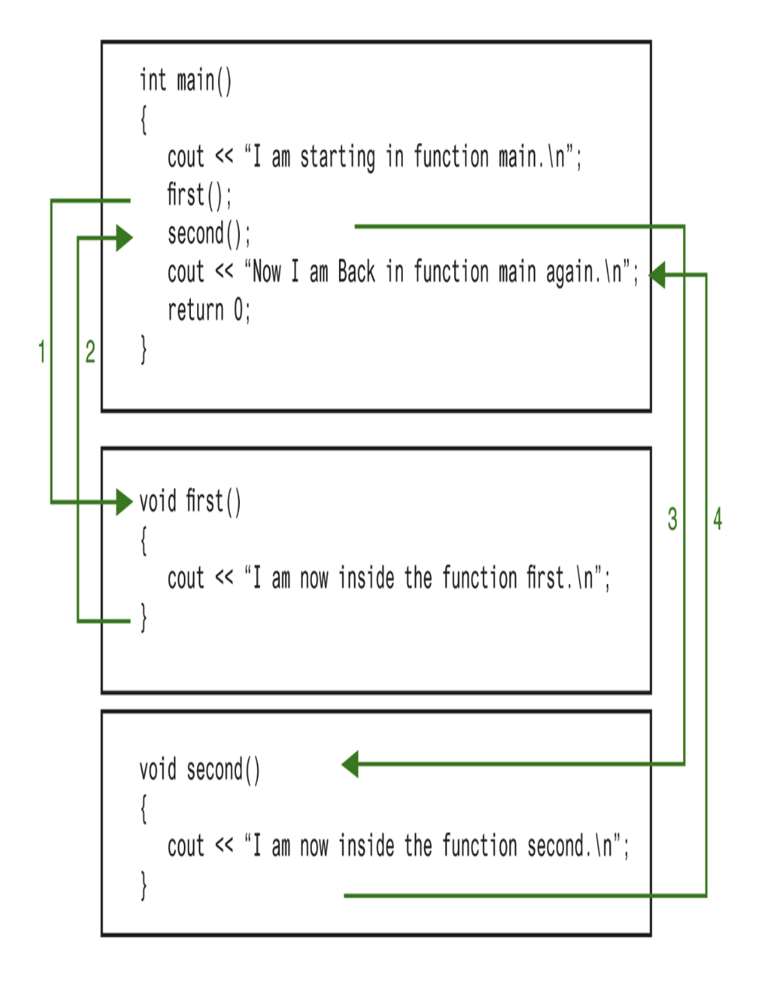

# 12 - Looping and Functions
2022-10-29


---

# Review

- what is the `while` loop?
- what is the `do-while` loop?

---

# For Loops

- `for` loops are special kinds of `while` loops
- still repeats a block of code
- composed of 4 parts:
    - initialization: sets up any necessary variables
	- condition: is checked before each loop
	- update: runs at the `end` of each loop
	- code block: code to be run

---

# For Loop Example

```
for(int days_left = 10; days_left > 0; days--){
	// do something
}

for(
	int days_left = 10; // initialization
	days_left > 0; // condition
	days_left-- // update
	){
	// do something	
}
```

---

# Exiting a loop

- `break` will exit out of a loop
  - useful if you hit some special case
- `continue` will skip rest of current iteration of loop
  - will go back to top of loop and stil check conditional

- our textbook recommends against using either keyword
  - in practice, I have seen them rarely used except in `switch` statements

---

# Loops Review

- `while` - execute code 0-infinite times, not sure when to stop
- `do-while` - execute code 1-infinite times, not sure when to stop
- `for` - execute code exactly n times

---

# Coding Lab

---

# Functions

- miniature programs that can be run from other programs / functions
- keeps to `DRY` principle
  - Don't
  - Repeat
  - Yourself
- textbook calls this `modular programming`

---

# Function Definition 1/2

```
return_type function_name (argument_type_1 argument_name_1, argument_type_2 argument_type_2, etc){
	// body of code
	return value;
}

char get_first_letter(string word){
	return word[0];
}
```

- note: `arguments` and `parameters` have slight differences in meaning in your textbook. I use `arguments` to mean both.
- first line is referred to as the `function header`

---

# Function Definition 2/2

- a function does not need any arguments. in this case, argument list is empty.
- a function does not need to return anything. in this case, it `must` have a `void` return type

---

# Function Calls

- a `function call` is when a defined function is requested to execute
- the `control flow` will pause where it currently is, run the function, and then come back

---



---

# Function Prototypes

- `functions` MUST be defined before they are called
- some file structures prevent you from doing this
  - usually happens when your program is multiple files
- `function prototypes` are .......


---

# Variable Scope

- `variable names` are created by the programmer to label information
- `variables` only have meaning within the `function` they are defined
  - this includes when a variable is passed into `arguments`
- `variables` in different `functions` are (usually) unconnected and separate
  - textbook calls this `pass by value`
