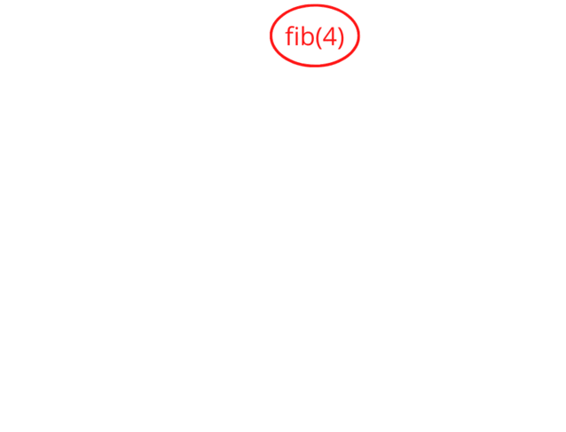

# 08 - HOFs and Memoization
2022-10-03

---

# Update on Code Pattern

There's a shortcut we can use with one of our previous `coding patterns`:

```
const greeting = {
	first_word: 'hello',
	second_word: 'world'
};

const object_old_method = Object.assign(
	{},
	greeting,
	{second_word: 'everyone'}
);

// alternate method

const object_new_method = {
	...greating,
	{second_word: 'everyone'}
}
```

---

# HOFs

- Answer questions that were brought up before
- Examine posted js file
- Where are the HOFs?

---

# Memoization

- A large benefit of `pure` functions is that the output is 100% predictable on the input
- If a function is `computationally expensive` then we can cache the result for any given inputs and skip the function
- This is called `memoization` (or creating a `memo`)

---

# Memoization Example 1/3

```
// classic recursive implementation of fibonacci sequence

const fibonacci = (n) => {
	if(n < 2){
		return 1;
	}
	return fibonacci(n - 1) + fibonacci(n - 2);
}

```

---

# Memoization Example 2/3



This can quickly lead to a `call stack exceeded` error.

---

# Memoization Example 3/3

```
// credit: https://www.geeksforgeeks.org/javascript-memoization/

function memoisedFibonacci(n, cache) {
    cache = cache || [1, 1]
    if (cache[n])
        return cache[n]
    return cache[n] = memoisedFibonacci(n - 1, cache) + 
    memoisedFibonacci(n - 2, cache);
}
```


---

# Memoization as HOF

```
// fibonnaci function from before
const with_memoization = (function_to_memoize) => {
    let memo = {};
    return (...args) => {
	if(memo[args]){
	    return memo[args];
	}
	const answer = function_to_memoize.apply(this, args);
	memo[args] = answer;
	return answer;
    };
}

const memoized_fibonacci = with_memoization(fibonacci);

const answer = memoized_fibonacci(10);
console.log(answer);
```

